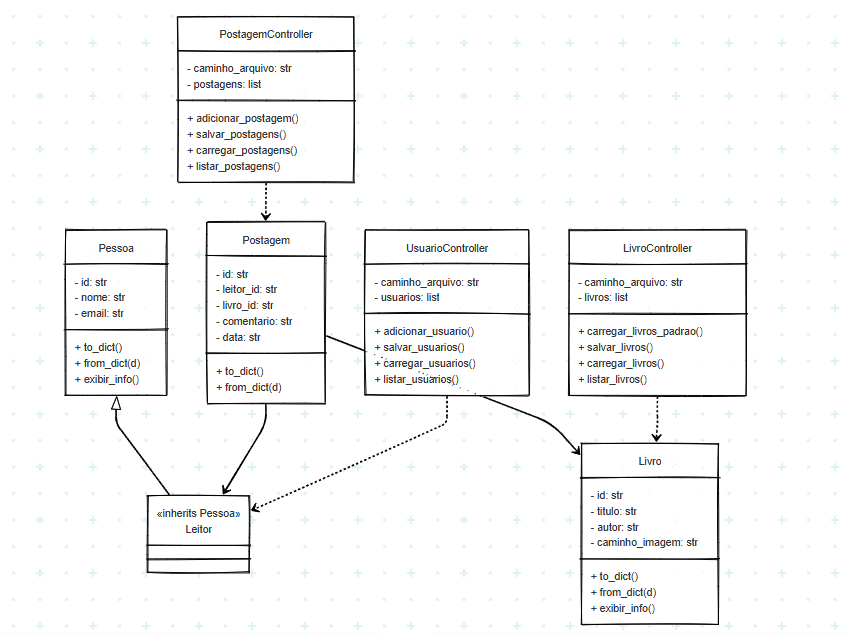

# 📚 Entrelinhas Clarice

**Entrelinhas Clarice** é um projeto desenvolvido como entrega do **Projeto Livre de Orientação a Objetos**, com foco na aplicação prática dos conceitos abordados em aula.

O sistema permite o **cadastro de leitores**, **registro de livros**, além da **criação e listagem de postagens com comentários** sobre obras literárias da autora **Clarice Lispector**, utilizando recursos da **orientação a objetos**.

---

## Como Executar o Projeto

### 🔧 Pré-requisitos

Antes de iniciar, instale os pacotes necessários:

```bash
pip install PySimpleGUI pillow
```

### ▶️ Executando

Para iniciar a **interface gráfica**:

```bash
python main_gui.py
```

> 💾 Os dados são salvos automaticamente nos arquivos `.json` localizados na pasta `data/`.

---

## Tela inicial:


## Exemplo de postagem:


---

## 💡 Motivação e Histórico

O sistema foi inicialmente implementado com **interface em terminal**, mas evoluiu para uma **interface gráfica** com **PySimpleGUI**.

No entanto, devido à nova política de licenciamento do PySimpleGUI (uso gratuito por apenas **30 dias** para hobbyistas), o projeto será retomado com foco em uma **versão web** para o **projeto final**:

- 🌐 **Serviços HTTP/HTTPS** com páginas HTML/CSS/JS.
- 🔐 **Sistema web com login** e controle de acesso.

Esta nova abordagem está alinhada à **macrotarefa proposta pelo professor**, permitindo ampliar os conhecimentos em desenvolvimento web com orientação a objetos.

---

## ✅ Critérios de Avaliação Atendidos

### ✔ Casos de Uso Implementados

- Cadastro de usuários (leitores).
- Registro de livros.
- Criação de postagens associando leitores e livros.
- Listagem, edição e remoção de postagens e usuários.
- Visualização dos livros disponíveis.

### ✔ Aplicação de Orientação a Objetos

- **Encapsulamento**: entidades como `Livro`, `Postagem`, `Pessoa`, `Leitor`.
- **Herança**: classe `Leitor` herda de `Pessoa`.
- **Composição forte**: `Postagem` composta por IDs de `Leitor` e `Livro`.
- **Associação fraca**: controladores manipulam listas de objetos.

### ✔ Serialização

- Dados persistidos via arquivos `.json`.
- Métodos `to_dict()` e `from_dict()` implementados para serialização.

### ✔ Interface Gráfica

- Desenvolvida com **PySimpleGUI**.
- Inclui **layouts com rolagem**, **campos interativos** e **janelas separadas por funcionalidade**.

---

## 📁 Estrutura do Projeto

```plaintext
├── controllers/
│   ├── livro_controller.py
│   ├── postagem_controller.py
│   └── usuario_controller.py
├── data/
│   ├── livros.json
│   ├── postagens.json
│   └── usuarios.json
├── imagens/
│   └── *.png (capas dos livros)
├── models/
│   ├── livro.py
│   ├── postagem.py
│   └── pessoa.py
├── diagrama/
│   ├── diagrama_uml.md
│   └── diagrama_mermaid.png
├── main_gui.py
├── README.md
```
## Diagrama de Classes


📄 Veja também: [Diagrama de Classes (código)](diagrama/diagrama_classes.md)

