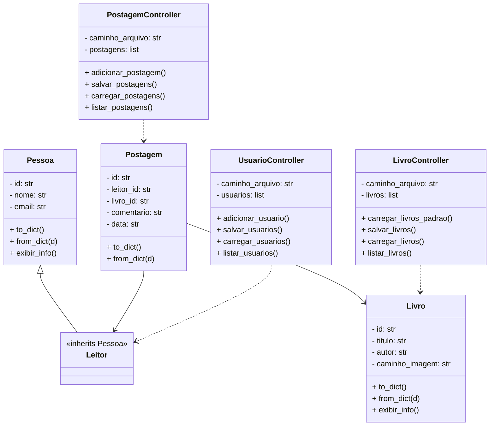

```mermaid
classDiagram
    class Pessoa {
        - id: str
        - nome: str
        - email: str
        + to_dict()
        + from_dict(d)
        + exibir_info()
    }

    class Leitor {
        <<inherits Pessoa>>
    }
    Pessoa <|-- Leitor

    class Livro {
        - id: str
        - titulo: str
        - autor: str
        - caminho_imagem: str
        + to_dict()
        + from_dict(d)
        + exibir_info()
    }

    class Postagem {
        - id: str
        - leitor_id: str
        - livro_id: str
        - comentario: str
        - data: str
        + to_dict()
        + from_dict(d)
    }

    class UsuarioController {
        - caminho_arquivo: str
        - usuarios: list
        + adicionar_usuario()
        + salvar_usuarios()
        + carregar_usuarios()
        + listar_usuarios()
    }

    class LivroController {
        - caminho_arquivo: str
        - livros: list
        + carregar_livros_padrao()
        + salvar_livros()
        + carregar_livros()
        + listar_livros()
    }

    class PostagemController {
        - caminho_arquivo: str
        - postagens: list
        + adicionar_postagem()
        + salvar_postagens()
        + carregar_postagens()
        + listar_postagens()
    }

    Postagem --> Leitor
    Postagem --> Livro

    UsuarioController ..> Leitor
    LivroController ..> Livro
    PostagemController ..> Postagem
```
